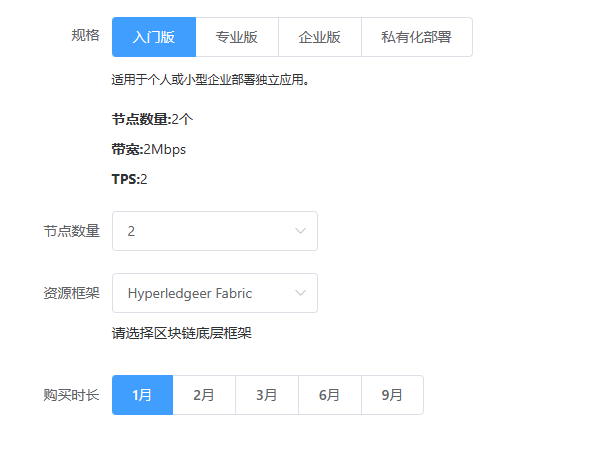

购买资源
=========
选择规格
_________
选择合适的资源进行购买，默认提供入门版、专业版、企业版可供用户选择。

参数解释：
___________

- **节点数量：** 是指运行区块链的节点数量，由于区块链的去中中心化的网络架构，所以更多的节点能提供更高的安全性和防篡改保护，同时访客可连接不同的节点，提高整体性能。

- **TPS：** 每秒能执行请示的最大数量，TPS要与业务实际需求匹配，当业务需求量大于TPS时，系统将等待队列请示执行完，才能响应最新请求。