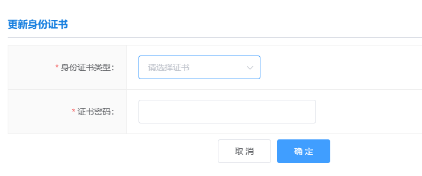
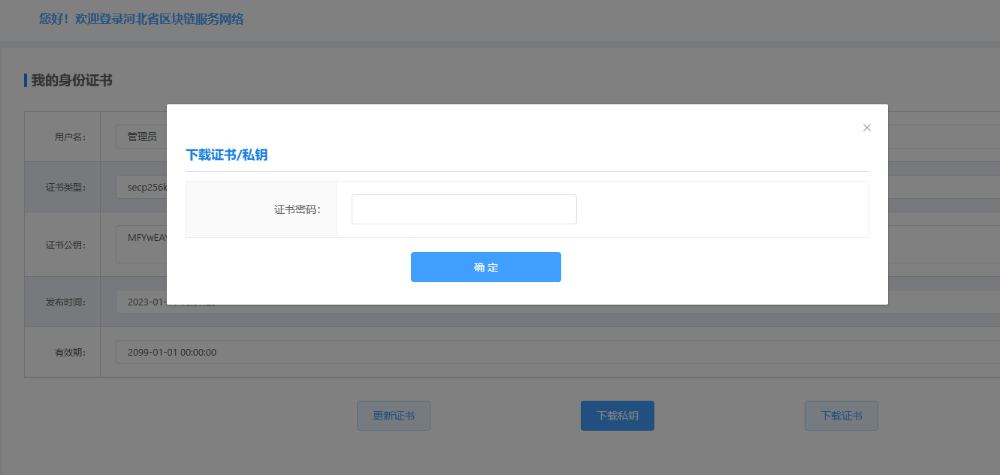
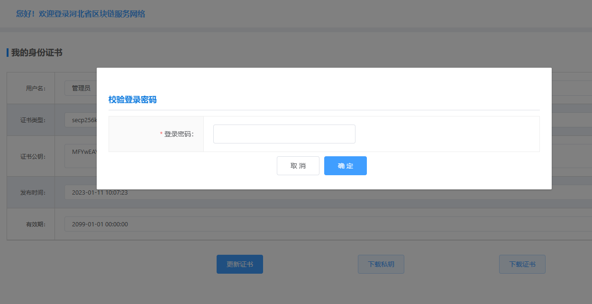

我的身份证书
==========

个人身份证书是用户和区块链交互的唯一凭证，请妥善保管，平台支持多种国密（sm2）和非国密（secp256k1,secp256r1）多种加密形式，生成证书前需要输入证书密码，证书密码是保护证书安全的又一道屏障。

下载私钥和证书
_______

输入证书密码即可下载证书，下载的证书用于SDK连接区块链。

更新证书
_____

当证书泄漏或面临安全风险时，应及时更新证书。``证书更新后，原接入服务将失效``，须导入新证书方可完成验签流程。

输入登录密码即可重新进行生成证书的操作。

