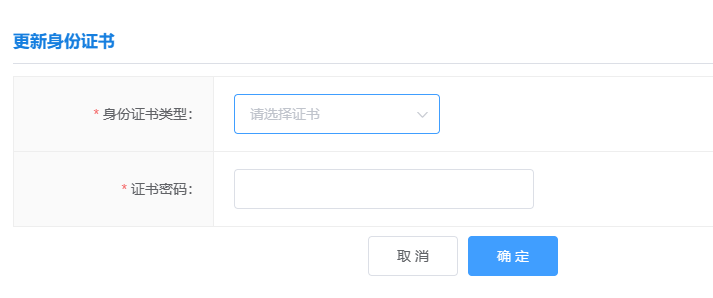
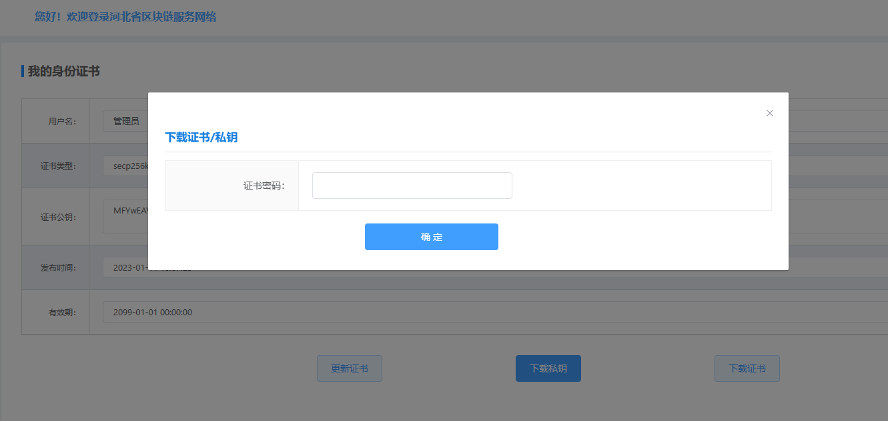
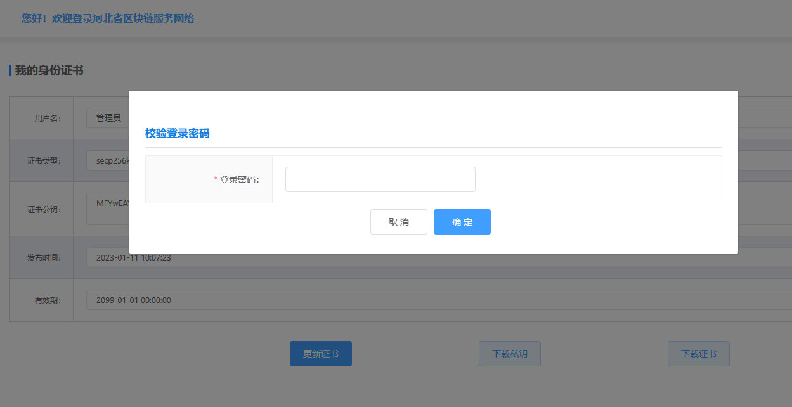
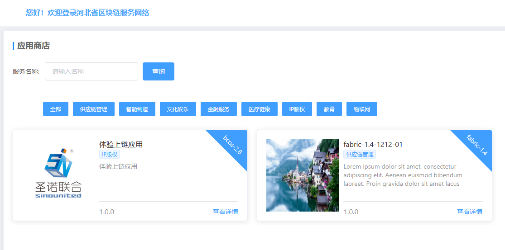
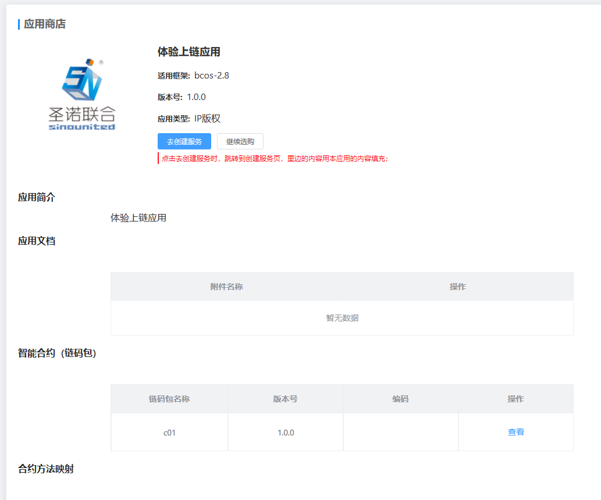
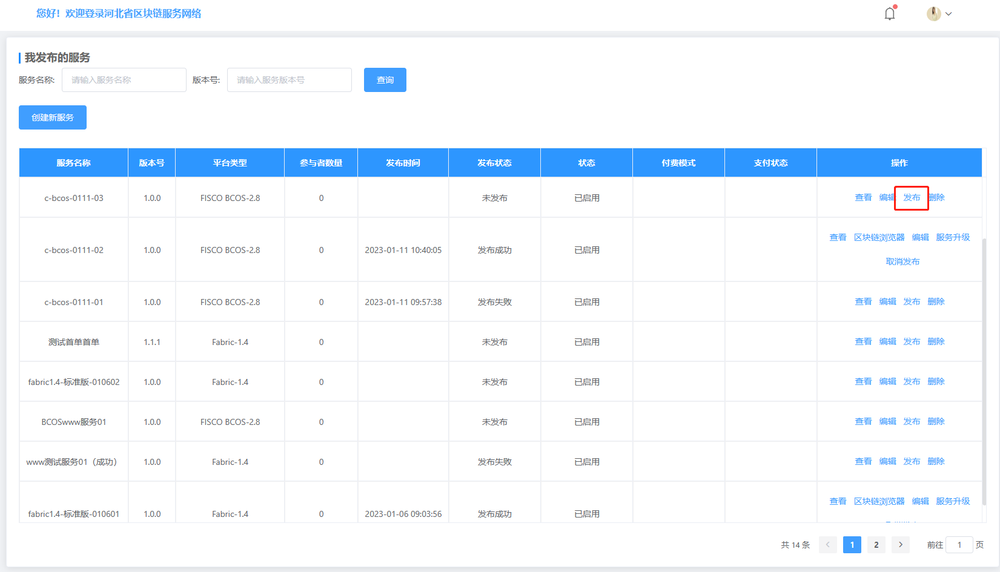

快速开始
=====

接入BaaS平台仅需3步：

1. **创建并生成个人密钥：** 密钥是个人访问区块链服务的唯一凭证；
2. **创建服务：** 根据页面引导完成服务创建，选择合适的应用模板，一键创建应用；
3. **服务接入：** 下载服务接入文档和SDK，一键接入区块链平台。

创建并生成个人密钥
----------
个人身份证书是用户和区块链交互的唯一凭证，请妥善保管，平台支持多种国密（sm2）和非国密（secp256k1,secp256r1）多种加密形式，生成证书前需要输入证书密码，证书密码是保护证书安全的又一道屏障。

下载私钥和证书
^^^^^^^^^^^

输入证书密码即可下载证书，下载的证书用于SDK连接区块链。

更新证书
^^^^^^^

当证书泄漏或面临安全风险时，应及时更新证书。``证书更新后，原接入服务将失效``，须导入新证书方可完成验签流程。

输入登录密码即可重新进行生成证书的操作。

创建服务
----------

进入应用商店，选择合适的应用。

点击“去创建服务”完成，一键创建服务。

创建成功的服务点击“发布”，等待发布状态变更为“发布成功”时，即可完成服务创建流程。

服务接入
----------

下载SDK，参照接口文档完成业务接入。

+------------+------------+-----------+-----------+
| 语言        | 版本        | 更新日期  | 操作        |
+============+============+===========+===========+
| Java       | V1.0.1   | 2023-01-11  | `下载文档 <https://hebbsn.com>`_ |
+------------+------------+-----------+-----------+
