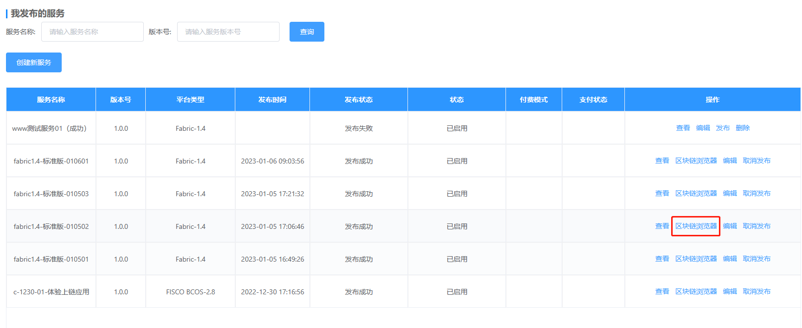
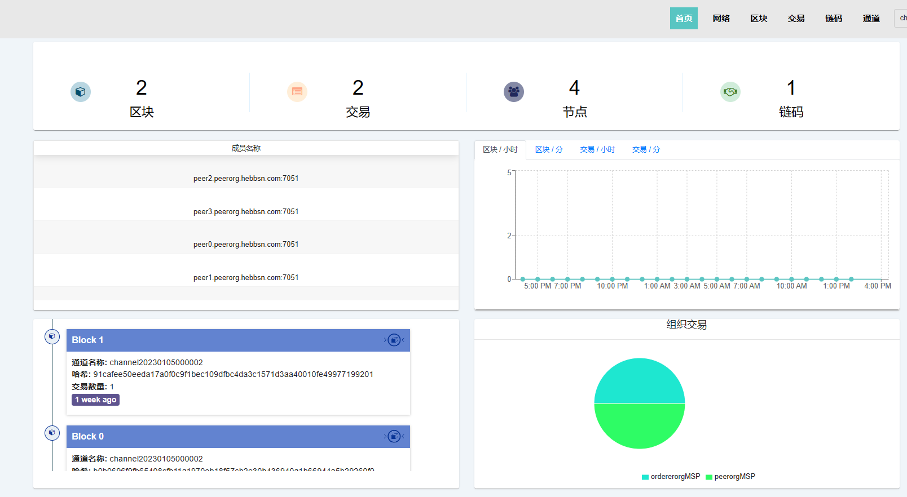

我发布的管理
==========

在“服务管理”-“我发布的服务”中，可对本人名下所有服务进行管理。其中，主要操作包括：

发布服务
------

创建成功的服务将暂存于BaaS平台，要和BaaS平台进行交互需要进行“发布”操作。

点击操作栏中的“发布”按钮，等待30-90秒。

.. image:: ../img/6.png

BaaS平台将自动为你完成以下内容：

- 分配资源
- 初始化区块链环境
- 创建独立的分组以实现数据隔离
- 部署智能合约
- 配置合约API

区块链浏览器
----------

区块链浏览器是链上数据可视化的主要窗口。 它可以记录和统计不同区块链网络(主要是公链)的每个区块、每笔交易以及地址等信息。 通过区块链浏览器，可以方便的查阅链上所有信息。

点击服务操作栏中的“区块链浏览器”链接。

区块链浏览器将为你呈现当前服务所产生的全部交易数据。

