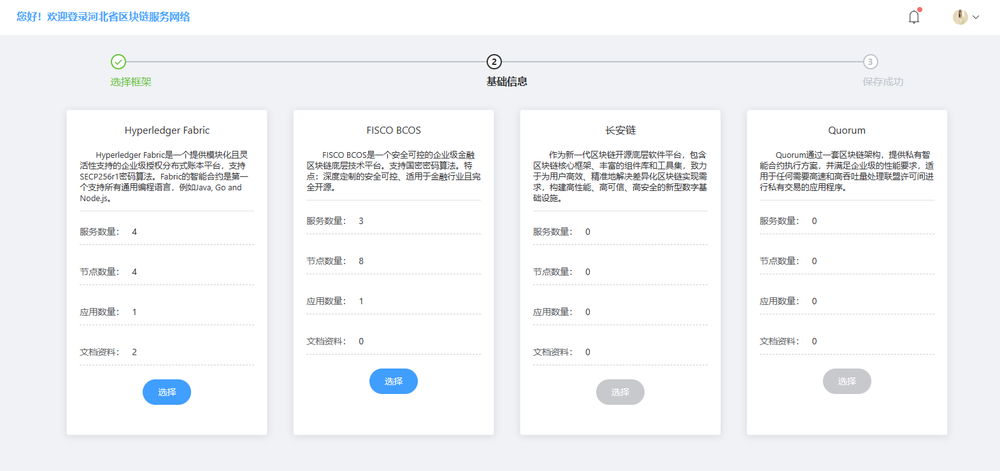
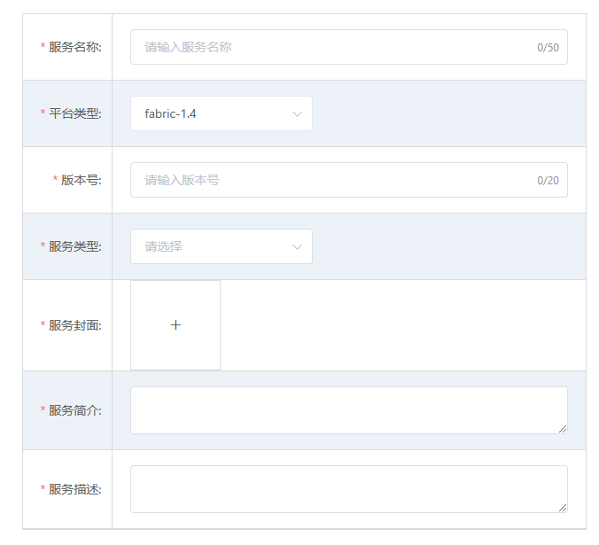
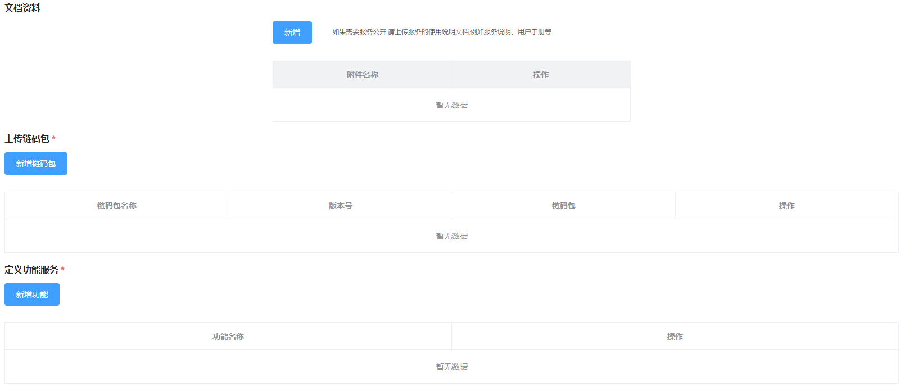
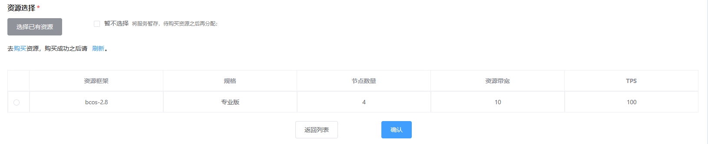
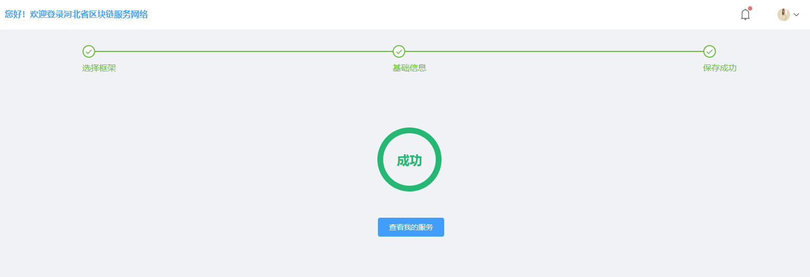
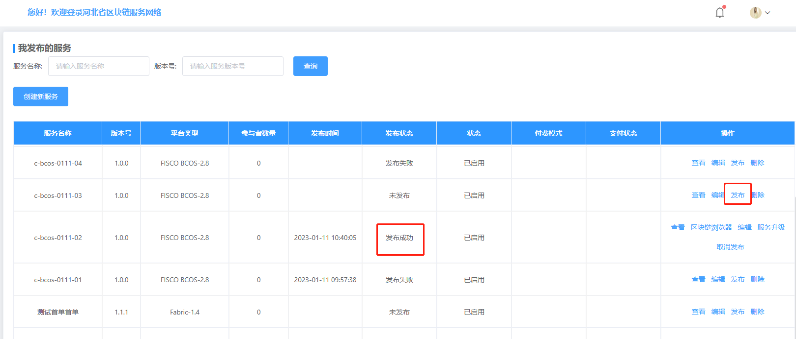

创建服务
=======

进入控制台，在“服务管理”中点击“创建服务”选项，进入创建服务流程。

选择服务框架
_________

平台支持多种区块链底层框架，用户可根据需求不同，选择区块链框架。

服务详情
_______
填写服务基本信息

上传文档资料、智能合约（链码包）并定义功能服务。

选择资源

创建成功

发布服务
________

进入“我发布的服务”列表，点击发布按钮，等待系统自动部署，部署完成之后系统状态显示为“发布成功”

